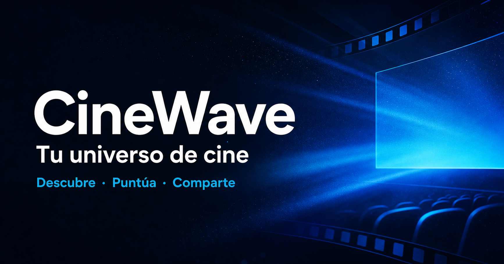

# CineWave

Una plataforma social de cine inspirada en la experiencia de IMDb: catálogo, búsqueda,
filtros, fichas completas, perfiles, valoraciones, reseñas, favoritos y listas para ver.
El proyecto original de un solo endpoint se ha convertido en una aplicación web completa,
segura y dockerizada.



## Funciones

- Inicio editorial con tendencias, mejor valoradas, próximos estrenos y géneros.
- Búsqueda de películas y explorador con filtros de género, año, nota y orden.
- Fichas con sinopsis, reparto, dirección, duración, tráiler, recomendaciones y datos técnicos.
- Registro, inicio de sesión y sesión persistente mediante cookie segura.
- Perfil editable, estadísticas y cronología de actividad.
- Favoritos y lista personal para ver.
- Valoraciones del 1 al 10 y puntuación agregada de la comunidad.
- Reseñas con aviso de spoilers y votos de utilidad.
- Comunidad con las últimas reseñas.
- API REST con validación, límites de peticiones, caché de TMDB y errores normalizados.
- Modo demo automático cuando no se configura una credencial de TMDB.
- Contenedores separados para API y web, proxy inverso y volumen persistente.

## Puesta en marcha con Docker

1. Copia `.env.example` como `.env`.
2. Añade `TMDB_READ_TOKEN` en `.env` para usar el catálogo completo. Puedes obtener el
   token en la configuración de API de tu cuenta de TMDB.
3. Arranca la aplicación:

   ```bash
   docker compose up --build
   ```

4. Abre [http://localhost:8088](http://localhost:8088).

Sin token de TMDB la aplicación arranca igualmente con un catálogo de demostración.
Los usuarios, listas, valoraciones y reseñas se guardan en el volumen `cinewave_data`.

Para detener la aplicación:

```bash
docker compose down
```

`docker compose down -v` también elimina los datos persistidos.

## Desarrollo local

Requiere Node.js 20 o superior.

```bash
npm install
npm run dev
```

- Web: [http://localhost:5173](http://localhost:5173)
- API: [http://localhost:3000/api/health](http://localhost:3000/api/health)

Los comandos principales son:

```bash
npm run build
npm test
npm start
```

## API

Los endpoints principales están bajo `/api`:

| Área | Endpoints |
|---|---|
| Catálogo | `GET /movies/home`, `/movies/search`, `/movies/discover`, `/movies/:id` |
| Cuenta | `POST /auth/register`, `/auth/login`, `/auth/logout`, `GET /auth/me` |
| Biblioteca | `GET /library`, `PUT/DELETE /library/:type/:movieId` |
| Valoraciones | `PUT/DELETE /ratings/:movieId` |
| Reseñas | `GET /reviews/latest`, `/reviews/movie/:movieId`, operaciones de creación y voto |
| Perfil | `GET /users/me/dashboard`, `/users/me/ratings`, `PATCH /users/me` |

El endpoint original `GET /busqueda?name=...` se conserva por compatibilidad, ahora con
validación y manejo de resultados vacíos.

## Estructura

```text
apps/
  api/          API Express y base de datos SQLite
  web/          React, Vite y estilos de la interfaz
compose.yaml    Orquestación de los contenedores
Dockerfile.api
Dockerfile.web
```

## Seguridad

La credencial de TMDB ya no está incluida en el código. Las contraseñas se almacenan con
hash bcrypt, las sesiones expiran, los datos se validan en el servidor y se aplican
cabeceras seguras y límites de peticiones. En un despliegue público usa un `JWT_SECRET`
largo, HTTPS y una política de copias de seguridad para el volumen.

Los datos cinematográficos y las imágenes pertenecen a TMDB. Este producto usa la API de
TMDB, pero no está respaldado ni certificado por TMDB.
